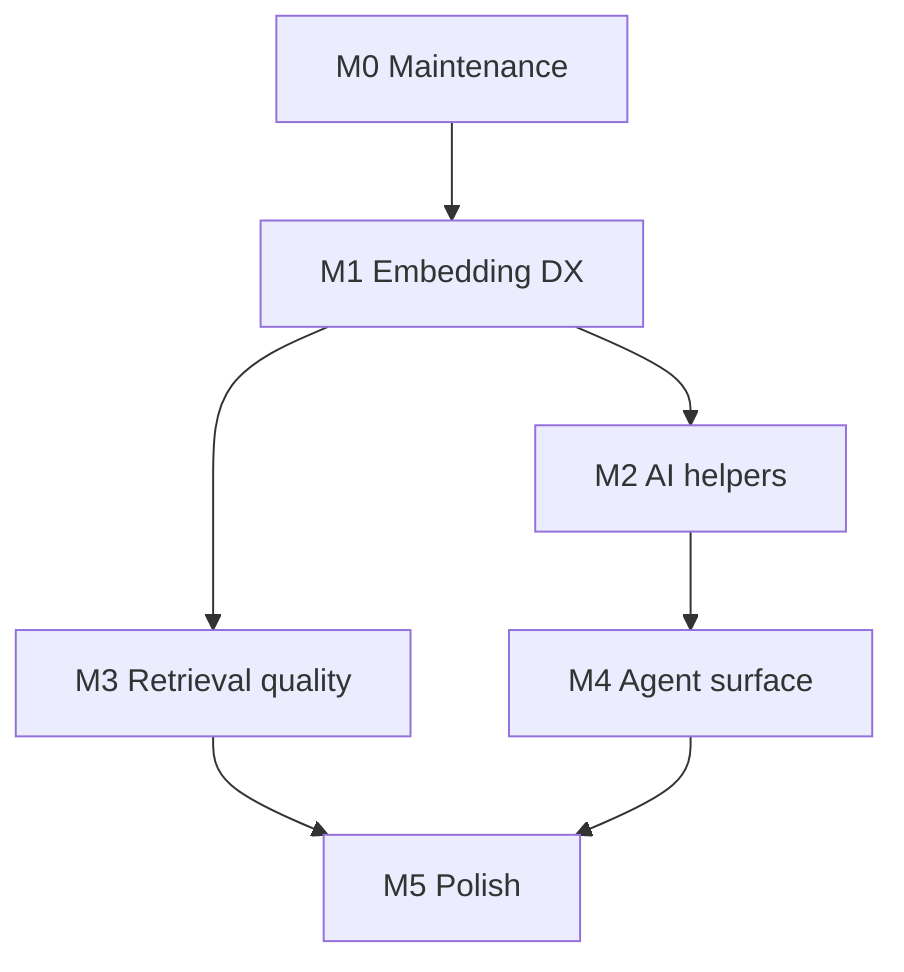

# Implementation Plan — RedisVL Upgrade Backlog (U1–U12)

**Source of requirements:** `REDISVL_UPGRADE_HANDOFF.md` (§4 backlog, §5 constraints, §6 sequencing, §7 open questions)
**Date:** 2026-09-24 · **Owner:** TBD · **Status:** Proposed

This plan turns the handoff's ranked backlog into an executable schedule. Each
work item lists: OM surface, files touched, implementation steps, tests,
acceptance, and effort. Everything below honors the repo's core invariants
(§1).

---

## 0. Verified current state (as of this writing)

| Fact | Status |
| --- | --- |
| `pyproject.toml` floors `redisvl>=0.27.2` (`full` + `redisvl` extras) | ✅ done |
| `uv.lock` resolves `redisvl 0.27.2`, `redis 7.4.1` | ✅ done (§2.1 complete) |
| `aredis_om/redisvl.py` — 471 lines, 3 public helpers (`to_redisvl_schema`, `get_redisvl_index`, `hybrid_search`), all lazy via `_import_redisvl()` | ✅ exists |
| Private API guards for `_convert_and_drop_empty_rows` / `get_protocol_version` (`redisvl.py:444-445`) | ❌ **not done** (§2.3 → M0) |
| redis-py 8 CI axis / decision (§2.2) | ❌ open (→ M0) |
| `tests/test_redisvl_integration.py` (728 ln), `tests/test_redisvl_cluster.py` (async-only, in `make_sync.py` `_ASYNC_ONLY_TEST_BASENAMES`) | ✅ exist |
| `redisvl_*` benchmarks in `tests/test_performance_benchmark.py` (~L1096+) | ✅ exist |
| `docs/redisvl.mdx`, `docs/pending_features.mdx` (SVS corrected to 8.2) | ✅ exist |
| U1–U12 features | ❌ none implemented |

---

## 1. Ground rules (invariants — apply to every item)

1. **Optional dependency discipline.** No module in `aredis_om` may import
   redisvl at import time. Every new surface goes through `_import_redisvl()`
   (or an equivalent lazy resolver) and stays out of `aredis_om/__init__.py`.
   `aredis_om` must import cleanly without redisvl installed.
2. **Sync parity.** All source edits go in `aredis_om/` + `tests/` only;
   `make sync` regenerates `redis_om/` + `tests_sync/`. Any test that cannot
   survive unasync goes into `make_sync.py` `_ASYNC_ONLY_TEST_BASENAMES`.
3. **Cluster safety.** redisvl does not route `FT.HYBRID` (and possibly cache/
   router/history index ops) on cluster. Cluster paths get explicit tests in
   `tests/test_redisvl_cluster.py` (async-only by design).
4. **No private API usage without a shim.** Anything importing a `_private`
   redisvl symbol needs a guarded import + fallback + loud regression test
   (see M0-A2).
5. **Namespace isolation.** AI-extension helpers (U3–U5) create their own
   indexes/prefixes. They must derive names from an explicit `name` argument
   or the model, must be distinguishable from OM index names, and must
   **refuse** to reuse a model's OM index name (assert against
   `to_redisvl_schema(model).index.name`).
6. **Security.** Never pass untrusted input to redisvl pattern operators
   (`%`). MCP configs default to read-only. Document JWT auth for HTTP
   transports.
7. **Redis version gates.** Feature-detect, don't assume: SVS-VAMANA (8.2+),
   `FT.HYBRID` (8.4+), vector sets (8.8+). Tests skip cleanly on older
   servers.
8. **Delegate, don't fork.** Wrap redisvl for connection reuse and
   ergonomics only. Never copy query logic into OM.

---

## 2. Architecture decisions (resolving handoff §7)

| # | Question (§7) | Decision | Rationale | Revisit trigger |
| --- | --- | --- | --- | --- |
| D1 | One module vs new `redisvl_ai.py`? | **New `aredis_om/ai/` package**, one module per extension, auto-mirrored to `redis_om/ai/` by `make sync` (the unasync walker is recursive — no `make_sync.py` changes needed). Helper names drop the `redisvl_` prefix (`get_semantic_cache`, not `get_redisvl_semantic_cache`) because the package provides the namespace. `redisvl.py` stays the interop escape hatch for redisvl-shaped outputs (schema, index, MCP config) and keeps its prefixed names. | A flat `redisvl_ai.py` would exceed 1000 lines and force `redisvl_`-prefixed names to avoid collisions. A package gives file-level cohesion and clean imports (`from aredis_om.ai import get_semantic_cache`). Distinct from `aredis_om/integrations/` (async-only bridge, excluded via `_ASYNC_ONLY_DIRS`): `ai/` MUST be sync-mirrored, so it must NOT be added to `_ASYNC_ONLY_DIRS`. | Split a module if any single file exceeds ~400 lines. |
| D2 | Is auto-embedding (U1) in scope for an ODM? | **Yes — but strictly opt-in and zero-cost when unused.** A model with no vectorizer must behave byte-identically to today: no redisvl import, no schema change, no save-path overhead beyond one dict lookup. | Biggest AI gap in the ODM (handoff §6 M1 rationale); standard in peer ODMs. The escape hatch (U2/U3 hand-out helpers) ships regardless, so U1 is additive not load-bearing. | If save-path overhead measurably regresses CodSpeed, move embedding resolution to explicit `await doc.embed()` calls only. |
| D3 | redis-py 7.4.x vs 8.x? | **Stay locked on 7.4.1** for releases. Add a **non-gating CI leg** with `redis>=8.0.1` + redisvl 0.27.x to catch drift (M0-A3). | redisvl excludes 8.0.0 (RESP3 defect); OM's RESP3 paths (`resp3_shim.py`, `test_protocol_compat.py`) are sensitive. A non-gating leg gives signal without betting releases on it. | When redisvl declares redis-py 8 support explicitly, promote the leg to gating. |
| D4 | LangCache (managed/paid) first-class? | **Docs-only.** Ship the local `SemanticCache` helper (U3); document LangCache's `server_url`/`cache_id`/`api_key` REST contract and the `redisvl[langcache]` extra in `docs/redisvl.mdx`. | Managed/paid REST service — wrong default for a library helper; users who want it can use redisvl directly with OM's connection URL. | Sustained user demand for a `LangCacheSemanticCache` wiring helper. |
| D5 | OM-owned MCP server? | **Config generator only** (`to_redisvl_mcp_config`, U7). OM never owns server lifecycle. | Server ownership = support burden; generation is pure serialization with no runtime dep on `redisvl[mcp]` (only the *consumer* needs it). | — |

**Package layout (D1):**

```text
aredis_om/ai/                 # mirrored to redis_om/ai/ by `make sync`
├── __init__.py               # re-exports only; NO redisvl imports (invariant 1)
├── cache.py                  # U2 get_embedding_cache · U3 get_semantic_cache
├── memory.py                 # U4 get_message_history, get_session_manager
├── router.py                 # U5 get_router
├── rerank.py                 # U6 rerank_results
├── embeddings.py             # U1 EmbeddingSpec (plain data) + lazy vectorizer resolution
└── compression.py            # U8 recommend_compression
```

Import-cycle note: `model.py` imports `EmbeddingSpec` from `aredis_om.ai.embeddings`
(a plain-data module, redisvl-free) and calls its resolver at save time; `ai/*`
modules reference model types only under `TYPE_CHECKING` and resolve
`model_cls.db()` at runtime — no cycle, no import-time redisvl.

---

## 3. Milestones

Dependency graph (→ = "unlocks/prereq"):



### M0 — Maintenance finish (effort: S, ~1–2 days)

> §2.1 (lock bump) is **already done**. Remaining:

**M0-A1 — Regression test: redisvl version + public surface (§2.3, partial).**
- Files: `tests/test_redisvl_integration.py`
- Add a test asserting `redisvl.__version__ >= 0.27.2` and that
  `redisvl.index.index.AsyncSearchIndex`, `redisvl.query.HybridQuery` etc.
  still exist — fails loudly on breaking bumps.

**M0-A2 — Guard private APIs in `hybrid_search()` (§2.3).**
- Files: `aredis_om/redisvl.py`, `tests/test_redisvl_integration.py`
- Replace bare imports (`redisvl.py:444-445`) with a compat module-level
  resolver:
  ```python
  def _load_private_helpers():
      try:
          from redisvl.index.index import _convert_and_drop_empty_rows
          from redisvl.utils.redis_protocol import get_protocol_version
          return _convert_and_drop_empty_rows, get_protocol_version
      except ImportError as e:
          raise ImportError(
              "redis-om's hybrid_search() relies on redisvl internals that "
              "changed in this version. Please pin redisvl to a compatible "
              "version or open an issue."
          ) from e
  ```
  Note: `get_protocol_version` is public-ish (no underscore) — keep the guard
  anyway; cost is trivial. Add a test that monkeypatch-deletes each symbol and
  asserts the friendly error (the existing tests already monkeypatch
  `_convert_and_drop_empty_rows` — keep them green).
- Acceptance: `hybrid_search` works unchanged; removing either symbol raises
  the friendly `ImportError`, not a raw stack trace.

**M0-A3 — redis-py 8 CI leg (§2.2, D3).**
- Files: `.github/workflows/*.yml` (redisvl/redis matrix leg, `redis>=8.0.1`,
  `continue-on-error: true` initially), `pyproject.toml` unchanged.
- Acceptance: leg runs the full redisvl + protocol-compat suites; results
  visible but non-gating.

**M0 gate:** `make lint && make test` green; M0-A2 test demonstrates friendly
failure; CI leg reporting.

---

### M1 — Embedding DX: U1 auto-embedding + U2 cache (effort: M, ~1–2 weeks)

**U1 — Auto-embedding for vector fields**

OM surface:
```python
class Doc(JsonModel, index=True):
    body: str = Field(full_text_search=True)
    embedding: list[float] = Field(
        vector_options=VectorFieldOptions.flat(...),
        vectorizer="openai:text-embedding-3-small",  # or a BaseVectorizer instance
        source="body",
    )
```

Implementation steps:
1. **Field metadata** (`aredis_om/model/model.py`): accept `vectorizer=` and
   `source=` on `Field(...)`; persist via `json_schema_extra` (same pattern as
   `_index_explicitly_set` — required to survive Pydantic's `FieldInfo`
   reconstruction on subclassing). Validate at class-creation time in
   `ModelMeta`: `source` field exists, is `str` (v1), target field has
   `vector_options`.
2. **Lazy resolution** (`aredis_om/ai/embeddings.py`, new): store specs as
   plain data until first use; resolve a string spec to a vectorizer instance
   on first `save()`/query via `_import_redisvl()` + provider factories.
   **No redisvl import at model-definition time.**
3. **Save hook** (`aredis_om/model/model.py`, after
   `planned_save_conversions()`, before `jsonable_encoder()`): for each
   embedding spec where the vector field is empty/None and `source` is
   non-empty → `await vectorizer.aembed(text)`. Respect dimension/type from
   `vector_options` (pack via existing `_pack_vector` path). Bulk `add()` and
   `save()` share this hook; `get_many` untouched (load path unchanged).
4. **Query hook** (`aredis_om/model/model.py` query builder / KNN path):
   when a KNN expression receives a raw `str` and the target field has a
   vectorizer → embed first, then build KNN params as today (keeping the
   PARAMS-based, escaped path).
5. **Sync mirror:** `unasync` handles `aembed` → `embed`; verify generated
   code compiles and passes mirrored tests.

Files: `aredis_om/model/model.py`, `aredis_om/ai/embeddings.py` (new),
`tests/test_auto_embedding.py` (new).

Tests (async + sync mirror):
- Define model with vectorizer → save with only `body` → stored vector has
  declared dim/type (decode via existing vector test helpers).
- Manual vector preserved (no re-embed when field populated).
- Raw-text KNN returns nearest doc.
- Model without vectorizer: assert `sys.modules` untouched (no redisvl
  import), schema identical to pre-U1 golden (regression vs. drift).
- Bulk `add()` with N docs embeds each once.
- Cache-off second save of identical `body` re-embeds (contrasts U2).

Acceptance (from handoff): saving with only `body` stores correct embedding;
raw-text KNN works; sync mirror passes; **no redisvl import when unused**.

**U2 — Embedding cache wiring**

OM surface: `class Meta: embedding_cache = True` (auto: reuse
`Meta.database`, key prefix derived from `key_prefix` + `:embcache`) or an
`EmbeddingsCache` instance (vectorizers accept `cache=`).

Implementation steps:
1. Factory in `aredis_om/ai/cache.py` (D1): `get_embedding_cache(model_cls)` →
   lazily constructs `EmbeddingsCache` bound to `model_cls.db()`, with a
   namespace that cannot collide with model keys.
2. Wire into U1's resolution step: when `Meta.embedding_cache` is set, pass
   `cache=` to the vectorizer on first resolution.
3. Docs: TTL + invalidation notes (`cache.delete()`), keying on
   `(content, model_name)`.

Files: `aredis_om/ai/cache.py` (new), `aredis_om/model/model.py`
(`_meta.embedding_cache`), `tests/test_auto_embedding.py` (extend).

Tests: second embed of identical text hits Redis (assert via cache stats or
monkeypatched `embed` call count); TTL honored; explicit instance respected.

**M1 gate:** all U1/U2 acceptance criteria; `make sync` + full test suite +
CodSpeed show no regression on non-embedding save paths (this is the D2 guard).

---

### M2 — AI extension helpers: U3, U4, U5 (effort: S each, ~1 week total)

All in the `aredis_om/ai/` package (one module per extension — see D1 layout),
all following the `get_redisvl_index()` pattern (schema/wiring via
`Meta.database`, lifecycle with caller), all with namespace isolation (§1.5).

**U3 — Semantic cache helper.**
- `get_semantic_cache(name, model_cls=None, *, vectorizer=None, ttl=None, distance_threshold=0.1)`
  in `aredis_om/ai/cache.py` → `SemanticCache` bound to `model_cls.db()`
  (or `Meta.database` default). Name is required-or-derived **with a
  `:vl-cache:` infix** and must differ from any OM index name (assert).
- LangCache: **docs-only** (D4).
- Tests: store/check round-trip; paraphrased prompt hits; namespace assertion
  raises on collision; cluster leg in `test_redisvl_cluster.py` (async-only).

**U4 — LLM memory / session helper.**
- `get_message_history(name, *, semantic=False, model_cls=None, session_tag=None)`
  in `aredis_om/ai/memory.py` → `MessageHistory` / `SemanticMessageHistory`;
  optional `get_session_manager(...)` thin wrapper.
- Tests: `add_messages` → `get_recent`; semantic variant `get_relevant`;
  session tags isolate conversations.

**U5 — Semantic-router helper.**
- `get_router(name, routes, model_cls=None)` in `aredis_om/ai/router.py` →
  `SemanticRouter`.
- Tests: `router("...")` returns `RouteMatch`; `to_dict/from_dict` round-trip.

**M2 gate:** all three helpers work end-to-end against compose Redis; lazy
import preserved (importing `aredis_om.ai` without redisvl installed works;
helpers raise the friendly `_LAZY_IMPORT_MESSAGE`-style error only on call);
cluster leg green or explicitly skipped with reasons.

---

### M3 — Retrieval quality: U6 rerank + U8 SVS/compression (effort: M+M, ~2 weeks)

**U6 — Reranking support.**
- Start with a **standalone helper** (non-invasive):
  `rerank_results(query_or_results, reranker, rank_by=None, limit=None)` in
  `aredis_om/ai/rerank.py` → delegates to `HFCrossEncoderReranker` /
  `CohereReranker` / `VoyageAIReranker.rank()`, returns `(results, scores)`
  with OM models rehydrated where applicable.
- Only if maintainers want chaining: `FindQuery.rerank(...)` as sugar.
- Tests: mocked reranker (no network) for ordering/limit semantics; real
  reranker behind an env-var-gated skip; **no reranker configured → identical
  results** (regression).

**U8 — SVS-VAMANA + compression advisor.**
- `VectorFieldOptions` (`model.py:3465`): add `ALGORITHM.SVS` + `svs()`
  factory with SVS-specific attrs only — `compression`,
  `construction_window_size`, `graph_max_degree`, `search_window_size`,
  `training_threshold`, `reduce`, `epsilon`. **Not** a copy of the HNSW
  branch (handoff doc-correction note). Enforce `FLOAT16`/`FLOAT32` only.
- Schema rendering: `_get_field_type` + `Migrator` FT.CREATE branch for SVS
  attrs; `to_redisvl_schema` maps to redisvl's `SVSConfig`
  (`redisvl.utils.compression`).
- Compression advisor: `recommend_compression(model_cls, field_name,
  sample_vectors)` in `aredis_om/ai/compression.py`, delegating to
  `CompressionAdvisor.recommend()` + `estimate_memory_savings()`.
- Tests: FT.CREATE string golden tests (schema level, no server needed);
  integration gated on Redis ≥8.2 (`tests/` version-detect skip);
  FLAT/HNSW golden schemas **unchanged** (regression); redisvl round-trip
  (`from_existing` sees the same attrs).

**M3 gate:** golden FLAT/HNSW schemas byte-identical pre/post; SVS tests skip
cleanly on 6380-node (Redis 8) only where feature absent; rerank no-op
regression green.

---

### M4 — Agent surface: U7 MCP, U9 queries, U10 migration, U11 data-plane (effort: M, ~2 weeks)

**U7 — MCP config generator (D5: generator only).**
- `to_redisvl_mcp_config(models, *, read_only=True, schema_overrides=None)`
  in `aredis_om/redisvl.py` (interop module — no `redisvl[mcp]` import needed
  to *generate*; only running `rvl mcp --config` needs the extra).
- Default `read_only=True`; document `--read-only` + JWT auth for HTTP
  transports; document that MCP reconstructs schema from live index metadata
  (hence optional `schema_overrides` for vector attrs).
- Tests: config structure vs. redisvl MCP schema (lazy import in test);
  round-trip by actually launching `RedisVLMCPServer` in an env-gated test
  (`redisvl[mcp]` installed); `list-indexes`/`search-records` against an
  OM-migrated index.

**U9 — Advanced query wrappers (scope: two helpers only).**
- Wrap `MultiVectorQuery` and `SQLQuery` (no OM analogue); everything else
  stays documented-not-wrapped. Helpers construct + execute against
  `get_redisvl_index(model)`, returning redisvl results unchanged.
- Tests: mocked/real index; docs show raw-index path side-by-side.

**U10 — Index-migration interop (docs-first, code optional).**
- Recommended: **document** redisvl `MigrationWizard`/`SchemaPatch` as the
  document-preserving alternative for big schema changes; note the alias
  conflict hazard (never run both engines against the same index name).
- Only build `migrate_with_redisvl(model)` if maintainers confirm demand
  (flagged as a decision point in the PR, not pre-built).

**U11 — Index data-plane helpers (docs only).**
- New section in `docs/redisvl.mdx`: `batch_search`, `paginate`,
  `update_by_filter`, `drop_by_filter`, `expire_keys`, `from_existing`, and
  `SearchResults.complete` for partial-result detection — all via the
  existing `get_redisvl_index()` escape hatch. No new code.

**M4 gate:** MCP config launches a server against an OM-migrated index;
docs build; no new runtime deps in core extras.

---

### M5 — Polish: U12 (effort: S, ~2–3 days)

- Docs: expand `docs/redisvl.mdx` (AI helpers, rerank, SVS, MCP, data-plane);
  move shipped items out of `docs/pending_features.mdx`.
- CLI: document `rvl index/stats/mcp` against OM-created indexes.
- Benchmarks (CodSpeed): add `redisvl_semantic_cache_hit`, `redisvl_embed_save`
  (vectorizer mocked to isolate OM overhead), `redisvl_rerank` (mocked
  reranker).
- Changelog + README feature bullets.

**M5 gate:** docs build; CodSpeed picks up new benchmarks; `make lint`,
`make test`, `make test_cluster` green.

---

## 4. Schedule summary

| Milestone | Items | Effort | Depends on | Exit gate |
| --- | --- | --- | --- | --- |
| M0 | §2.3 guards, §2.2 CI leg, surface test | S | — | friendly errors + CI leg |
| M1 | U1, U2 | M | M0 | auto-embed + cache acceptance |
| M2 | U3, U4, U5 | S ×3 | M1 (U2 shares `ai/cache.py`) | helpers end-to-end |
| M3 | U6, U8 | M ×2 | M1 (vector plumbing) | golden-schema regression |
| M4 | U7, U9, U10, U11 | M | M2 | MCP launch + docs |
| M5 | U12 | S | M2–M4 | docs + benchmarks |

Parallelization: M2 and M3 are independent after M1 and can run concurrently
(disjoint files: `ai/` package + docs vs `model.py` schema paths — coordinate
on `redisvl.py` touchpoints via M0-A2 landing first).

---

## 5. Test & CI strategy

- **Environments:** compose Redis 8 (6380) / Valkey 9 (6381) for unit+integration;
  cluster compose for `test_redisvl_cluster.py`. Version-gated skips for
  SVS (≥8.2) and `FT.HYBRID` (≥8.4) — reuse the existing `checks.py` /
  capability-detection helpers rather than new ad-hoc probes.
- **Sync mirror:** every new test file must survive unasync or be added to
  `make_sync.py` `_ASYNC_ONLY_TEST_BASENAMES` (cluster/MCP tests are the
  likely additions). `make sync` must produce a clean diff.
- **Network-dependent tests** (real vectorizers, rerankers, MCP launch):
  env-var-gated skips by default; mocked versions always run.
- **Regression anchors:** (a) golden FLAT/HNSW `FT.CREATE` strings; (b) no-
  vectorizer model schema identical pre/post U1; (c) rerank no-op identical
  results; (d) `aredis_om` imports without redisvl (existing test — extend to
  cover every module in `aredis_om/ai/`).
- **CI:** add redisvl axis `{0.27.x}` × redis-py `{7.4.x, 8.0.1+}` (8.x leg
  non-gating per D3); CodSpeed on push/PR (existing workflow).

---

## 6. Risk register

| Risk | Likelihood | Impact | Mitigation |
| --- | --- | --- | --- |
| redisvl renames private symbols (`_convert_and_drop_empty_rows`) | Medium | `hybrid_search` breaks | M0-A2 shim + loud test; pin floor; CI axis |
| U1 regresses save-path performance (CodSpeed) | Medium | Blocks D2 | Zero-cost guard: single dict lookup when no specs; benchmark before/after; fallback = explicit `embed()` only |
| Embedding at save-time adds network latency/ failure modes | High | Save fails on provider outage | Embed errors wrap as `RedisModelError` with field context; document `embed()` manual escape hatch |
| Sync mirror breaks on `aembed` patterns | Medium | CI red | Mirror tests from day one; unasync rules already handle async methods — verify `embed` vs `aembed` naming |
| AI helper index names collide with OM indexes | Low | Data corruption | Namespace infix + explicit assert vs `to_redisvl_schema(...).index.name` |
| SVS rendering diverges between `Migrator` and `to_redisvl_schema` | Medium | Silent index mismatch | Golden tests for both emitters; `from_existing` round-trip test |
| MCP schema reconstruction misses vector attrs | High (documented upstream) | Broken MCP search | `schema_overrides` param + docs; env-gated launch test |
| Two migration engines fight over aliases (U10) | Medium | Index corruption | Docs-first; warn loudly if `backend="redisvl"` ever ships |

---

## 7. Definition of Done — global checklist (applies to every item)

- [ ] Async source in `aredis_om/` only; `make sync` clean; sync tests pass.
- [ ] Lazy import discipline: `aredis_om` imports without redisvl; new helpers
      raise the friendly error only on call.
- [ ] Tests: async + sync mirror (or justified `_ASYNC_ONLY_TEST_BASENAMES`
      entry); mocked for network paths; version-gated skips where needed.
- [ ] Cluster path tested or explicitly skipped with reason.
- [ ] `make lint` (ruff + format + mypy) clean.
- [ ] `docs/redisvl.mdx` / `docs/pending_features.mdx` updated (shipped items
      move out of pending).
- [ ] No new hard dependencies; optional extras documented in `pyproject.toml`
      where needed (e.g. `redisvl[llm-cache]` note, not a new OM extra).
- [ ] CodSpeed: no regression on touched paths; new benchmarks where the
      milestone calls for them.
