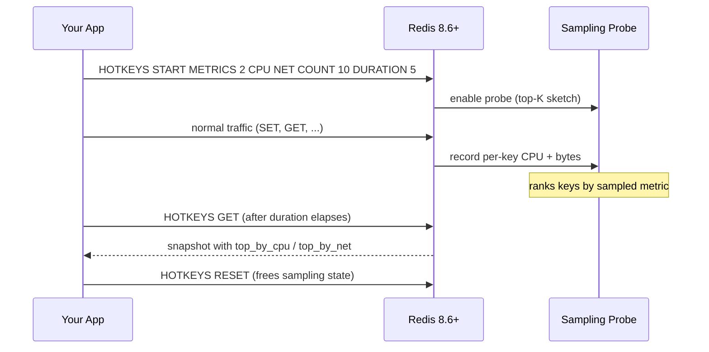

# Hot Keys Tracker (Redis 8.6+)

Redis 8.6 introduced a built-in **top-K hot-key sampler** (`HOTKEYS`)
that profiles which keys dominate CPU time or network bytes during a
sampling window. Previously this required the deprecated
`redis-cli --hotkeys` LFU scan, which:

- only saw keys after eviction pressure,
- required `maxmemory-policy` to be LFU-based,
- returned LFU counter values, not actual CPU/byte attribution.

The new sampler is opt-in, lightweight, and reports real resource
usage. It works in both standalone and cluster mode (where it can target
specific hash slots).

> **Server requirement**: Redis 8.6+. The `hotkeys_*` helpers probe the
> server and raise a Redis `ResponseError` on older builds; use
> `has_hotkeys(db)` to guard caller code.

## Quick start

```python
import asyncio
from aredis_om import get_redis_connection, hotkeys_snapshot


async def main():
    db = get_redis_connection()

    # Run a 5-second sampling window for both CPU and NET metrics.
    # (Generate load on `db` from your application during this window.)
    snap = await hotkeys_snapshot(db, duration_seconds=5)

    print(snap)
    # > HotKeysSnapshot(active=False, cpu_ms=42, net_bytes=12345,
    # >                  top_by_cpu=3, top_by_net=3)

    # Top 3 keys by CPU time (microseconds).
    for key, us in snap.top_by_cpu:
        print(f"  {key}: {us}us")
    # >   user:1234: 1840us
    # >   blob:big: 920us
    # >   session:abc: 410us

    # Top 3 keys by network bytes.
    for key, nbytes in snap.top_by_net:
        print(f"  {key}: {nbytes} bytes")


asyncio.run(main())
```

All functions are also available from the sync mirror
(`from redis_om import hotkeys_snapshot`) — drop `await`.

## How it works



## API reference

### `hotkeys_start(db, *, metrics=("CPU",), top_k=10, duration_seconds=0, sample_ratio=1, slots=None)`

Begin sampling. Returns `True` on success.

| Argument | Type | Description |
| --- | --- | --- |
| `metrics` | `Sequence[str]` | One or both of `"CPU"` and `"NET"`. Determines which ranked sections appear in the snapshot. |
| `top_k` | `int` | Value of K for the top-K sketch (default 10). |
| `duration_seconds` | `int` | Sampling duration in seconds. `0` (default) means track until `hotkeys_stop()` is called. Non-zero values must be between 1 and 1,000,000. |
| `sample_ratio` | `int` | Sample 1/N keys (default 1 = every key). Higher values reduce overhead at the cost of accuracy. |
| `slots` | `Sequence[int]` or `None` | Cluster mode only — restrict sampling to these hash slots. Default is all slots. |

### `hotkeys_stop(db)` → `bool`

Stop an in-progress sampling session. Results remain available via
`hotkeys_get()` until `hotkeys_reset()` is called.

### `hotkeys_reset(db)` → `bool`

Free the sampling state. **Must** be called after `hotkeys_stop()` (or
after a fixed-duration session has ended) before starting a new one.

### `hotkeys_get(db)` → `HotKeysSnapshot`

Retrieve the current sampling result as a parsed snapshot.

### `hotkeys_snapshot(db, *, metrics=("CPU", "NET"), top_k=10, duration_seconds=1, sample_ratio=1, slots=None)` → `HotKeysSnapshot`

High-level convenience: run a complete cycle (start → wait → get →
reset) and return the parsed snapshot. `duration_seconds` MUST be >= 1
for this helper.

### `HotKeysSnapshot` dataclass

| Field | Type | Description |
| --- | --- | --- |
| `tracking_active` | `bool` | `True` if sampling is still running. |
| `sample_ratio` | `int` | 1/N sampling ratio (1 = every key). |
| `duration_ms` | `int` | Total sampling duration in milliseconds. |
| `total_cpu_user_ms` | `int` | User-mode CPU time consumed during sampling. |
| `total_cpu_sys_ms` | `int` | Kernel-mode CPU time consumed during sampling. |
| `total_net_bytes` | `int` | Network bytes attributable to all sampled keys. |
| `top_by_cpu` | `list[tuple[str, int]]` | `(key, microseconds)` ranked by CPU. Empty if `CPU` not requested. |
| `top_by_net` | `list[tuple[str, int]]` | `(key, bytes)` ranked by network bytes. Empty if `NET` not requested. |
| `raw` | `dict` | Full server reply, for forward compatibility. |

### `has_hotkeys(db)` → `bool`

Returns `True` when the server supports `HOTKEYS` (Redis 8.6+).

## Manual control

For long-running sampling windows where you want to fetch intermediate
results, use the low-level commands directly:

```python
from aredis_om.hotkeys import hotkeys_start, hotkeys_get, hotkeys_stop, hotkeys_reset

# Run indefinitely (duration=0), checking intermediate results.
await hotkeys_start(db, metrics=["CPU", "NET"], duration_seconds=0)

# ... your app generates load ...

# Poll at any time.
snap = await hotkeys_get(db)
print(snap.top_by_cpu[:3])

# Stop and clean up when done.
await hotkeys_stop(db)
final = await hotkeys_get(db)
await hotkeys_reset(db)
```

## Cluster mode

In Redis Cluster, pass `slots=` to restrict sampling to specific hash
slots. This is useful for attributing load to a specific shard or
troubleshooting hot slots:

```python
# Only sample keys in slots 0-1000.
await hotkeys_start(db, metrics=["CPU"], slots=range(0, 1001), duration_seconds=10)
```

When `slots` is omitted, the sampler tracks all slots (reported in
`snapshot.raw["selected-slots"]`).

## Metrics reference

| Metric | Server flag | Reports | Units |
| --- | --- | --- | --- |
| CPU | `METRICS n CPU` | per-key CPU time | microseconds (`top_by_cpu`) |
| NET | `METRICS n NET` | per-key network bytes | bytes (`top_by_net`) |

Both metrics can be requested simultaneously (`metrics=["CPU", "NET"]`);
the cost is negligible because both are derived from the same command
samples.

## Full source

See [`aredis_om/hotkeys.py`][source] for the implementation and
[`tests/test_observability_hotkeys.py`][tests] for the full test suite
(11 tests).

[source]: https://github.com/XChikuX/redis-om-python/blob/main/aredis_om/hotkeys.py
[tests]: https://github.com/XChikuX/redis-om-python/blob/main/tests/test_observability_hotkeys.py
